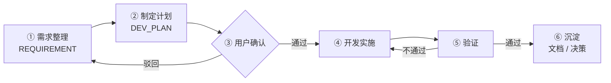

# AI 开发流程(AI Development Workflow)

> 目的:让 AI 参与的每一次改动都**可追溯、可验收、可回滚**,避免「AI 上来就改代码、结果和预期完全不符」。  
> 核心原则:**先整理需求,再制定计划,确认后开发。**


---

## 1. 总览



| 阶段     | 谁主导          | 产出物                          | 出口条件                 |
| ------ | ------------ | ---------------------------- | -------------------- |
| ① 需求整理 | AI 起草 + 用户补充 | `docs/requirements/REQ-*.md` | 验收标准明确且无歧义           |
| ② 制定计划 | AI           | `docs/plans/PLAN-*.md`       | 任务可执行、影响范围已列全        |
| ③ 确认   | **用户**       | —                            | 用户明确表示「按计划做」         |
| ④ 开发   | AI           | 代码改动                         | 计划内任务全部完成            |
| ⑤ 验证   | AI + 用户      | 验证记录                         | 类型检查/构建通过 + 功能符合验收标准 |
| ⑥ 沉淀   | AI           | 文档、决策记录                      | 文档与代码一致              |

---

## 2. 阶段① 需求整理

**目标:把模糊的诉求变成可验收的条目。**

必须写清的四件事:

1. **背景与动机** —— 为什么要做?解决谁的什么问题?
2. **范围(In / Out)** —— 什么在本次做,**什么明确不做**。Out of scope 和 In scope 同等重要。
3. **验收标准** —— 可观察、可判断的完成条件。避免「体验更好」这类无法验收的描述。
4. **约束** —— 技术限制、兼容性要求、时间／成本边界。

写作要点:

- 一条需求一个文件,文件名 `REQ-YYYYMMDD-<短横线-slug>.md`。
- 不确定的地方**列成待确认问题**抛给用户,不要自行假设后静默推进。
- 用 [`templates/REQUIREMENT.md`](./templates/REQUIREMENT.md) 作为起点。

**出口条件**:用户确认需求描述与验收标准无误。

---

## 3. 阶段② 制定计划

**目标:把需求翻译成一份「照着做就能完成」的施工图。**

计划必须包含:

| 要素      | 说明                         |
| ------- | -------------------------- |
| 方案概述    | 一句话说清技术路线                  |
| 影响文件清单  | **逐个列出**要新增/修改的文件及改动性质     |
| 任务拆解    | 有序、可独立验证的步骤(每步 ≤ 一次可提交的改动) |
| 数据/接口变更 | 是否涉及表结构、环境变量、外部 API        |
| 风险与降级   | 可能出问题的地方 + 出问题怎么办          |
| 回滚方案    | 如何撤销                       |
| 验证方式    | 具体怎么证明它work(命令 + 手工步骤)     |

写作要点:

- 至少给出 **2 个候选方案**并说明取舍理由(除非确实只有一条路)。
- 明确 **Out of scope**,防止范围蔓延。
- 标注需要用户提供的信息(密钥、域名、账号等)。
- 用 [`templates/DEV_PLAN.md`](./templates/DEV_PLAN.md) 作为起点。

**出口条件**:计划完整到「换一个人也能照着执行」。

---

## 4. 阶段③ 用户确认(强制关卡)

AI 将计划**用自然语言复述一遍**(不是丢个文件链接),突出:

- 将要改什么、不改什么
- 需要用户拍板的取舍点
- 预期结果

用户明确同意后才进入开发。**未经确认不得修改任何文件。**

---

## 5. 阶段④ 开发实施

规则:

- **严格按计划执行。** 发现计划有误 → 停下来,说明原因,更新计划并重新确认。
- **小步前进。** 每个任务完成后自检,再进入下一个。
- **不夹带私货。** 不顺手重构、不引入计划外依赖。若确有必要,单独提出。
- 新增依赖前先说明用途、体积与替代方案,经用户同意再装。
- 涉及数据库、密钥、线上环境的动作,**每一步都先确认**。

---

## 6. 阶段⑤ 验证

最低要求(本仓库):

```bash
pnpm build   # 构建通过(当前唯一强制校验关卡)
pnpm dev     # 手工验证功能
```

> `pnpm astro check` 当前不可用 —— `@astrojs/check` 与 `typescript` 未列入 `devDependencies`。需要类型校验时先 `pnpm add -D @astrojs/check typescript`。

检查清单:

- [ ] 验收标准逐条对照,全部满足
- [ ] 构建无错误输出
- [ ] 构建产物可正常启动(`node dist/server/entry.mjs`)
- [ ] 未引入密钥泄露、未提交 `.env`
- [ ] 未破坏既有功能(登录、首页渲染)
- [ ] 若涉及 schema 变更,迁移文件已生成且经过审核

验证不通过 → 回到阶段④;反复失败 → 回到阶段② 重新评估方案。

**不得在未验证的情况下声称「已完成」。** 无法验证的部分要显式标注为「未验证」并说明原因。

---

## 7. 阶段⑥ 沉淀

- 更新受影响的文档(`docs/ARCHITECTURE.md`、`README.md`、`AGENTS.md`)。
- 关键设计取舍写入 `docs/DECISIONS.md`(可选,建议保持 append-only)。
- 可复用的操作流程沉淀为 Skill 或脚本,而不是留在对话里。
- 清理临时文件与调试代码。

---

## 8. 轻量通道(Trivial Change)

以下情况可跳过阶段①②的**文档产出**,但仍需口头说明「要改什么、为什么、怎么验证」并取得同意:

- 文案修正(改 `src/content/index.md`)
- 样式微调、错别字、注释修正
- 单文件、单函数的小 bug 修复

**不允许走轻量通道的**:涉及认证(`src/lib/auth.ts`)、中间件、数据库 schema、部署配置(`Dockerfile`、`astro.config.mjs`)、环境变量的任何改动。

---

## 9. 反模式清单

| 反模式                 | 后果          | 正确做法               |
| ------------------- | ----------- | ------------------ |
| 未确认需求就写代码           | 返工,浪费上下文    | 先出 `REQ-*.md`      |
| 口头计划即开工             | 实现与预期偏差无据可查 | 先出 `PLAN-*.md` 并复述 |
| 一次性大改数十个文件          | 无法回滚、无法定位问题 | 小步提交               |
| 「顺手」重构              | 引入无关风险      | 单独提需求              |
| 改完不跑 `pnpm build`     | 构建错误流入主干    | 强制验证               |
| 修改 better-auth 表字段名 | 登录直接失效      | 保持契约不变             |
| 把密钥写进代码/文档          | 安全事故        | 只用环境变量             |
| 声称完成但未验证            | 信任崩塌        | 如实标注验证状态           |
| 计划外新增依赖             | 体积与安全风险     | 先提出再安装             |

---

## 10. 触发用语约定

与 AI 协作时可使用以下简写:

| 用语              | 含义           |
| --------------- | ------------ |
| `需求: <描述>`      | 进入阶段①,产出需求文档 |
| `计划` / `plan`   | 基于当前需求进入阶段②  |
| `按计划做` / `开始开发` | 通过阶段③,进入阶段④  |
| `验证`            | 执行阶段⑤检查清单    |
| `沉淀` / `收尾`     | 执行阶段⑥        |

若 AI 在未收到「按计划做」之前就开始改文件,视为流程违规,可直接指出并要求回退。
